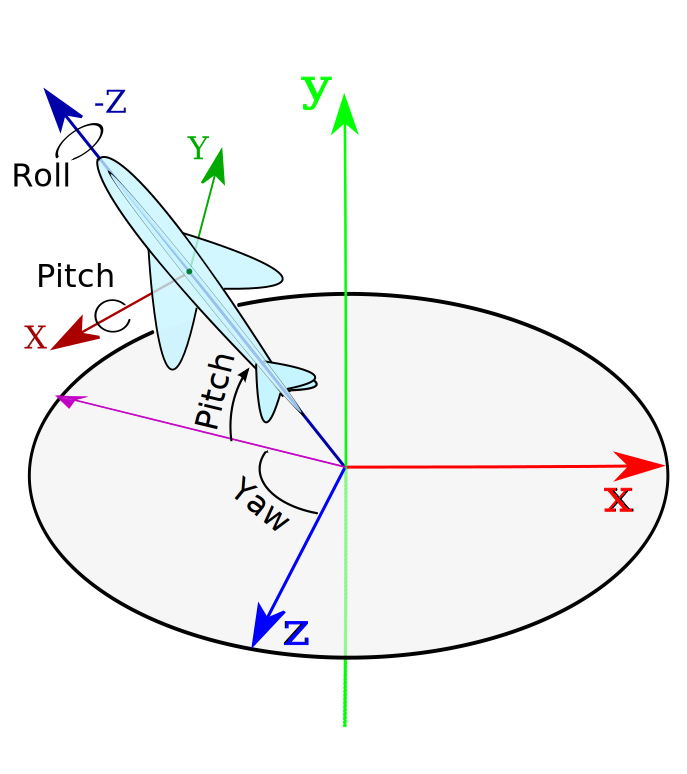
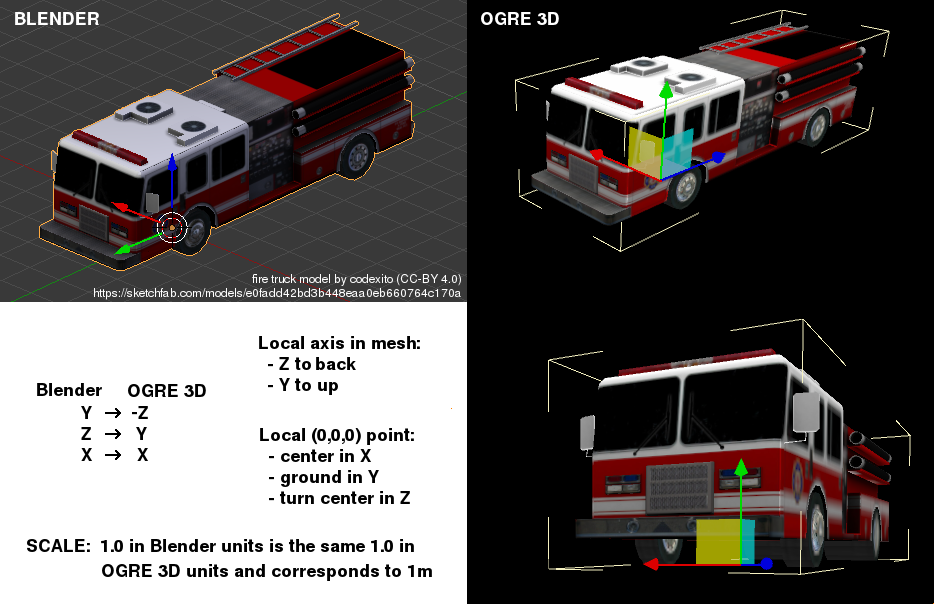

Coordinate System and recommended Mesh design     {#CoordinateSystem}
=============================================

@tableofcontents

@section coordinateSystem World coordinate system

Ogre uses the **X-Z** plane as the "ground" / "floor" in a scene. **Y** axis is vertical and points **up** direction.
See also: [Ogre Tutorial / Coordinates Systems](https://ogrecave.github.io/ogre/api/1.11/tut__first_scene.html#CoordinatesSystems).



<div style="font-size:x-small;">[CoordinateSystemAndRotations.svg](CoordinateSystemAndRotations.svg) based on CC-BY licenced https://commons.wikimedia.org/wiki/File:Plane.svg by [Juansempere](https://en.wikipedia.org/wiki/User:Juansempere)</div>


@section pivot Mesh pivot

Local axis in mesh:
- **Y** to up
- **Z** to back (negative Z to front)

Local (0,0,0) point (pivot) of mesh (for typically meshes in MGE) is located on:
- mesh turning point in **X-Z** plane, typpically
  - on mesh center in X axis (center between sides of mesh)
  - on center or closer to front of mesh in Z axis
- ground level in **Y** axis (typpically mesh bottom)




@section scale World scale

%MGE assumes that 1.0 units length in Ogre corresponding to 1.0 m length.


@section blenderConversion Blender coordinate conversion

[Blender](https://www.blender.org/) uses other coordinate system, when exporting Ogre mesh from Blender is converted to Ogre:
- Blender Y to Ogre -Z
- Blender Z to Ogre  Y
- Blender X to Ogre  X

Scaling is not performed (1.0 units length in Blender is the same 1.0 units length in Ogre).


@section blenderExport Export from Blender

-# prepare blender file:
  - set pivot point
  - set materials names
  - join submeshes into one mesh and set good name
  - apply transform (rotation, scale, ...)
-# export from Blender with "Ogre3D (.scene and .mesh)" from [https://github.com/OGRECave/blender2ogre](https://github.com/OGRECave/blender2ogre)
-# edit material names in exported `.xml` mesh files, for example:<br />
	```for f in *.xml; do  sed -Ee 's#(material|name)="([^"]*)"#\1="MODEL_NAME/\2"#g' -i $f;  done```
-# if model have skeleton edit path to skeleton in `.xml` (project use resources with path related to group base directory – when `.mesh` file is included with path, internal reference to `.skeleteon` should use this path too)
-# generate Ogre binary `.mesh` files:<br />
	```echo "Plugin=/usr/local/lib/OGRE/RenderSystem_NULL" > plugins_tools.cfg;  for f in *.xml; do  OgreMeshTool -v2 -t $f;  done```


@section svgGroundsTextures SVG grounds textures

Ground textures can be prepared as .svg files in Inkscape. In this case we recommend:

* use separate layers for "patterns" and for various types of surfaces
* add texture on "patterns" layer via:
  * read bitmap file via: File → Import
  * select created object, put it outside "page" area (used to export)
  * convert (selected) object to pattern via: Object → Pattern → Object to Pattern
* group all object with the same texture
  * set filling on group level
  * adjust texture (pattern) scale, rotation, offset via:
    * select group
    * use "edit paths by nodes" (F2 key)
    * manipulate settings on original (pattern source object)
* manual management of patterns names in XML source (Inkscape don't allow set pattern name and create new pattern when copying objects or manipulating their size or filling)
* export as PNG (with 512 pixels per 10 meters in 3D world) and convert to JPEG

Sample of SVG source file are provided in [SampleMod](https://github.com/dragons-labs/MGE-SampleMod) in `Media/Grounds/src`.


@section TransformMatrixes Transform Matrixes

There are three basic matrixes of transformations of reference systems:
-# **world matrix**
  - describes the location of the object in the world: position of the anchorage (*pivot* / local zero) point, rotation and scale of the object
  - transforms the local coordinates of mesh (the position of the grid point relative to the *pivot* point) to the coordinates of the world
-# **view matrix**
  - describes the location of the world relative to the camera
  - inverse view matrix describes the location of the camera in the world
-# **projection matrix**
  - describes the way the camera is viewed (position near clip plane and far clip plane relative to the camera, viewing angle of the camera)

`worldviewproj_matrix = projection_matrix * view_matrix * world_matrix`

We can calculate the resulting position of the point on the screen (more precisely on the viewport associated with the camera for which we render) as:

`modelViewProjectionMatrix * [local mesh point position, 1]`
