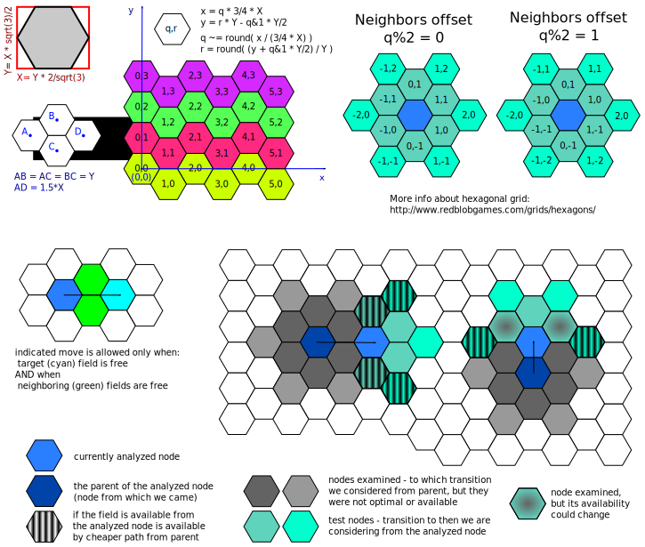

Path Finding Subsystems                                     {#PathFinding}
=======================

MGE use two path finding systems:
* zlib/libpng licenced [MicroPather](https://sourceforge.net/projects/micropather/) by Lee Thomason for searching path on @ref MGE::Modules::WorldMap "world map" (using png file as roads source). See:
  * [original readme file](MicroPather_readme.html)
  * SRC/engine/utils/pather/micropather.h and SRC/engine/utils/pather/micropather.cpp
* own a-star pather implementation inspirated by MicroPather for searching path in 3D world. See: @ref MGE::Physics::PathFinder.

Booth path finding systems uses hexagonal grid.

